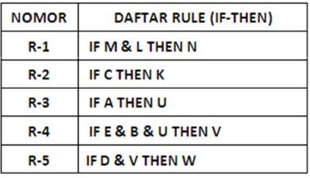
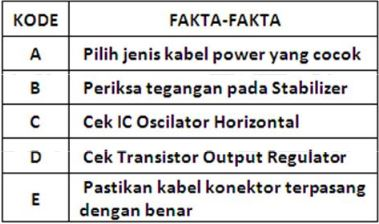
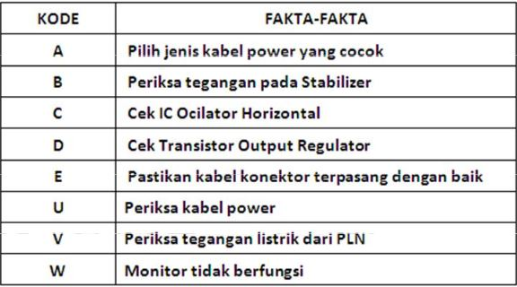
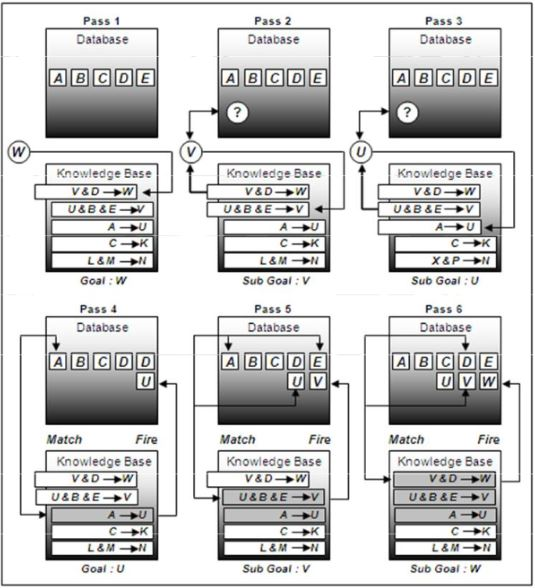
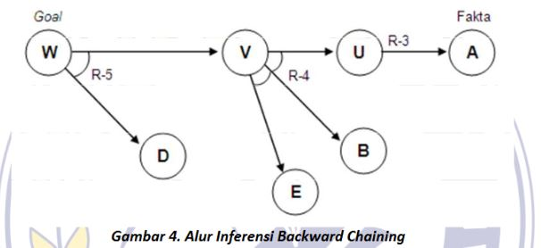

# Backward Chaining

## Latar Belakang Masalah
Menjelaskan metode Backward Chaining bagaimana membuat komputer seolah-olah menjadi pakar di dalam kecerdasan buatan

## Permasalahan dan Solusi Masalah
Backward chaining adalah metode inferensi yang dapat dijelaskan secara bahasa sehari-hari sebagai bekerja mundur dari tujuan. Ini digunakan dalam teorema-teorema otomatis, mesin inferensi, dan aplikasi kecerdasan buatan lainnya. 
 
Runut balik (Backward chaining) merupakan strategi pencarian yang arahnya kebalikan dari runut maju (Fordward Chaining). Proses pencarian dimulai dari tujuan dan kesimpulan menjadi solusi permasalahan yang dihadapi. Mesin inferensi mencari kaidah-kaidah dalam basis pengetahuan yang kesimpulannya merpakan soluasi yang ingin dicapai, dari kaidah-kaidah yang diperoleh masing-masing kesimpula dirunut balik jalur yang mengarah ke kesimpulan tersebut.  Jika nilai dari atribut-atribut yang mengarah ke kesimpulan tersebut sesuai dengan data yang diberikan maka kesimpulan tersebut merupakan solusi yang dicari, jika tidak sesuai maka kesimpulan tersebut bukan solusi yang dicari. Runut balik memulai proses pencarian dengan suatu tujuan sehingga strategi ini disebut juga goal-driven.  

Studi Kasus :  
Menelusuri kerusakan monitor  
 
1. Rule base  
Berisi himpunan aturan yang berhubungan dengan kerusakan komputer, pencarian bagian kerusakan, jenis kerusakan dan gejala kerusakan. Sebagai langkah awal pemecahan masalah dengan cara menemukan fakta-fakta yang sesuai dengan rule-rule (IF-THEN) diatas, selanjutnya menyusun data fakta dan menginisialisasi dengan menggunakan variable-variabel. 

 

2. Fakta-fakta  
A,B,C,D, dan E diberikan pemecahan masalah yaitu berupa data-data variable dengan kategori kerusakan, jenis kerusakan, gejala kerusakan dan deteksi kerusakan. Oleh inference engine dilakukan eksekusi data dengan mencocokan knowledge base (IF-THEN) yang telah dibuat dengan fakta-fakta yang tersimpan di dalam database. 

3. Database  
Memuat fakta A,B,C,D,E,U,V dan W berupa data-data variable kategori, jenis, gejala dan deteksi kerusakan. Pada table ini terjadi penambahan fakta U,V, dan W karena terjadi eksekusi terhadap data-data yang terdapat pada knowledge base.

 

Dari hasil eksekusi inference backward chaining dapat digambarkan dengan pla permodelan sebagai berikut :  

Pencocokan fakta dimulai dari sebelah kanan (THEN). Penalaran dimulai dari hipotesis dan untuk menguji kebenaran hipotesis dicari fakta-fakta yang ada dalam knowledge base. Fakta awal yang diberikan adalah A ( A bernilai benar), setelah dieksekusi dapat dibuktikan (hipotesis : W) bernilai benar.

## Kesimpulan  
Sistem pakar yang diimplementasikan menggunakan inferensi backward chaining akan memberikan solusi dari suatu masalah berdasarkan kumpulan pengetahuan yang ada yang kemampuannya menyerupai seorang pakar komputer dalam mencari dan memberikan petunjuk mengenai berbagai masalah yang terjadi

## Saran 
Sebaiknya selalu diadakan praktik tiap minggu agar mahasiswa lebih memahami tentang materi kecerdasan buatan

## Daftar Pustaka
[1] https://en.wikipedia.org/wiki/Backward_chaining  
[2] https://lppm.trigunadharma.ac.id/public/fileJurnal/hpxZJurnal%2011_1_2012%20M-Dahria-4.pdf  

## Scan Plagiarisme :
[1] https://drive.google.com/open?id=0B3mytGJbyhIhOXR2NldwNXFGcnM  
[2] https://drive.google.com/open?id=0B3mytGJbyhIhQ2IwV1FDNEhmLTA 

